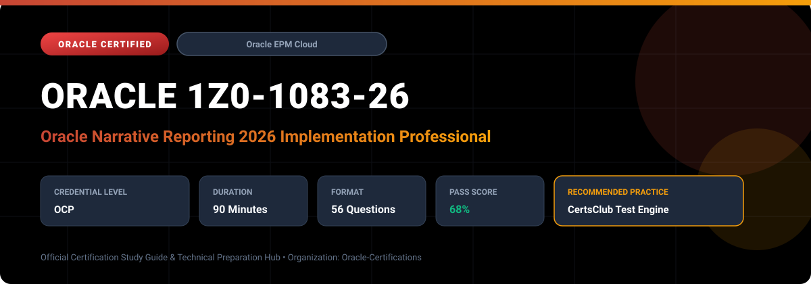

  

# Oracle 1Z0-1083-26: Oracle Narrative Reporting 2026 Implementation Professional

---

## 1. Exam Overview & Candidate Profile

The **Oracle 1Z0-1083-26: Oracle Narrative Reporting 2026 Implementation Professional** examination is engineered for enterprise architects, solution specialists, functional consultants, and implementation professionals seeking formal industry recognition of their proficiency in Oracle technologies.

The Oracle Narrative Reporting 2026 Implementation Professional (1Z0-1083-26) certification verifies comprehensive knowledge in deploying narrative reporting solutions across corporate finance, investor relations, and regulatory compliance teams. The exam tests end-to-end management of collaborative reporting workflows, XBRL tagging, dynamic variables, and automated book distributions.

### Target Audience & Prerequisites
- **Target Roles**: Implementation Specialists, Cloud Architects, Technical Leads, Enterprise Functional Consultants, and Systems Engineers.
- **Recommended Experience**: 1–2 years of practical, hands-on experience designing, implementing, and maintaining corresponding Oracle Cloud solutions.
- **Credential Earned**: Oracle Certified Professional (OCP).

---

## 2. Key Exam Specifications

| Specification | Details |
| :--- | :--- |
| **Exam Code** | **Oracle 1Z0-1083-26** |
| **Official Title** | Oracle Narrative Reporting 2026 Implementation Professional |
| **Certification Track** | Oracle Enterprise Performance Management Cloud |
| **Exam Duration** | 90 Minutes |
| **Number of Questions** | 56 Questions |
| **Passing Score** | 68% |
| **Question Format** | Multiple Choice (Single/Multiple Answer), Scenario-Based Questions |
| **Delivery Provider** | Oracle University / Pearson VUE (Online Proctored or Test Center) |
| **Recommended Practice Engine** | [CertsClub Oracle Practice Tests](https://www.certsclub.com/oracle/1z0-1083-26-dumps.html) |

---

## 3. Official Blueprint & Exam Domain Breakdown

The examination assesses candidate competencies across core functional domains weighted as follows:

| Domain Area | Weighting |
| :--- | :--- |
| **Report Packages & Document Lifecycle Architecture** | `30%` |
| **Management Reporting, Books, & Bursting Setup** | `25%` |
| **Disclosure Management & XBRL / Regulatory Tagging** | `20%` |
| **Data Source Connections & Smart View Integration** | `15%` |
| **Security, User Access, Administration & Distribution** | `10%` |

---

## 4. Deep Dive into Complex & Challenging Technical Topics

To secure a passing score on the 1Z0-1083-26 exam, candidates must master the following advanced concepts:

- Implementing static vs. dynamic Variables in Report Packages to update dates, metrics, and textual snippets globally.
- Configuring Disclosure Management taxonomies, SEC/ESMA regulatory validations, and inline XBRL (iXBRL) document generation.
- Designing multi-report Books with table of contents, unified numbering, and automated cascading filters.
- Administering access controls, library folders, audit trails, and data source connections across EPM and ERP Cloud.

---

## 5. Scenario-Based Demo & Practice Questions

### Question 1
In Oracle Narrative Reporting, how can a report administrator update the reporting period text (e.g., 'Q3 FY2026') across 50 individual doclets simultaneously without manual editing?

A) Create and update a Central Variable in the Report Package.
B) Delete and recreate the Report Package.
C) Re-execute the General Ledger posting rule.
D) Run a database re-index script.

- **Correct Answer**: `A) Create and update a Central Variable in the Report Package.`  
- **Technical Explanation**: Report Package Variables (both static and reference variables) enable centralized text and number management. Changing the variable value once automatically propagates across all doclets referencing it.

---

### Question 2
What is the primary function of the 'Sign-Off Phase' in an Oracle Narrative Reporting Report Package lifecycle?

A) To allow authors to draft new content.
B) To provide designated executives the opportunity to review the final locked document and formally approve or reject publication.
C) To initiate data loads from source systems.
D) To convert Word documents into PowerPoint slides.

- **Correct Answer**: `B) To provide designated executives the opportunity to review the final locked document and formally approve or reject publication.`  
- **Technical Explanation**: The Sign-Off phase is the final governance gate where the report is locked against further authoring edits, allowing senior executives to review the complete deliverable and submit formal sign-off.

---

## 6. Recommended Preparation Strategy & Practice Testing Engine

Achieving certification in **Oracle 1Z0-1083-26** requires balanced theoretical study and scenario-based simulation practice:

1. **Review Oracle Documentation**: Master architecture guides, implementation workbooks, and administration manuals on the Oracle Help Center.
2. **Hands-on Lab Practice**: Execute real-world configuration, policy setup, and troubleshooting tasks in your cloud tenancy or test instance.
3. **Simulated Exam Drills**: Practice answering timed, scenario-based multiple-choice questions to familiarize yourself with the question formats, traps, and timing constraints.

### Practice With CertsClub
For realistic practice questions, updated dumps, and mock testing environments:
- **Resource**: [CertsClub Oracle Practice Test Engine](https://www.certsclub.com/oracle/1z0-1083-26-dumps.html)
- **Special Discount**: Use coupon code **`club20`** during checkout for an instant **20% discount** on all practice exam bundles and testing engines.

---

## 7. Official Documentation & References

- [Oracle University Certification Registry](https://education.oracle.com/)
- [Oracle Help Center Documentation Portal](https://docs.oracle.com/)
- [Oracle Cloud Infrastructure & Applications Guides](https://docs.oracle.com/en/cloud/)
- [CertsClub Oracle Certification Exam Practice](https://www.certsclub.com/oracle/1z0-1083-26-dumps.html)

---

## 8. SEO & Discovery Keywords

`oracle 1z0-1083-26, oracle 1z0-1083-26 exam, oracle 1z0-1083-26 dumps, 1Z0-1083-26 practice questions, 1Z0-1083-26 study guide, oracle 1z0-1083-26 syllabus, oracle narrative reporting 2026 implementation professional, certsclub 1z0-1083-26`
